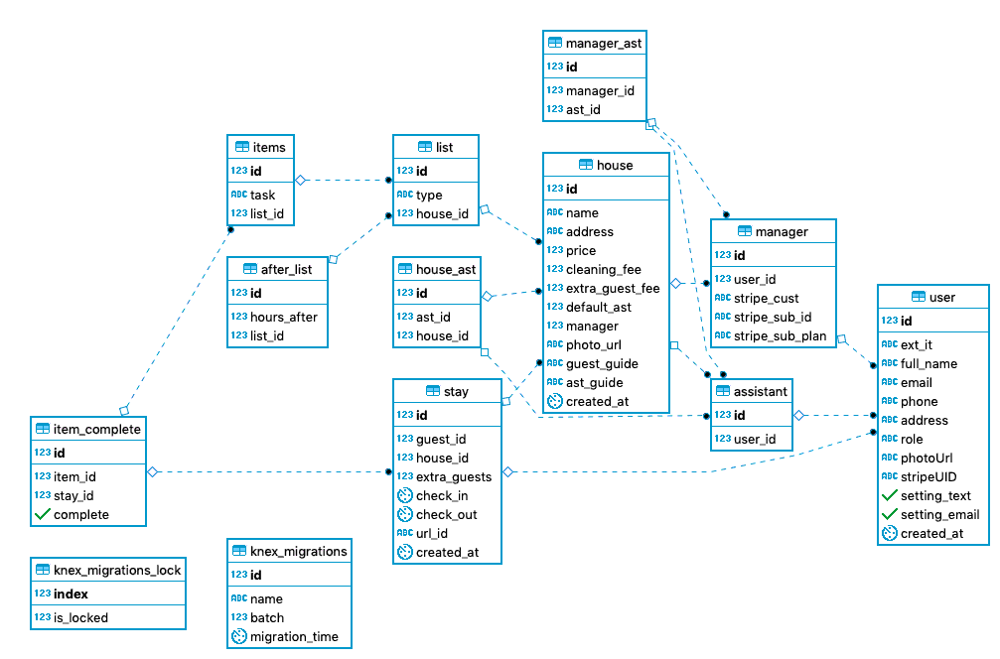

# Labs 9 - Lodgel

### Contributors:

|                                                [Kelly Frohwein](https://github.com/kelfro)                                                |                                         [Chris Honda](https://github.com/honda0306)                                          |                                             [Ronald Libago](https://github.com/Mister-Corn)                                              |                                       [Nando Theessen](https://github.com/NandoTheessen)                                       |                                              [William VanDolah](https://github.com/wvandolah)                                              |
| :---------------------------------------------------------------------------------------------------------------------------------------: | :--------------------------------------------------------------------------------------------------------------------------: | :--------------------------------------------------------------------------------------------------------------------------------------: | :----------------------------------------------------------------------------------------------------------------------------: | :----------------------------------------------------------------------------------------------------------------------------------------: |
|                                                                |                                                |                           |               |                                                            |
|                                                        |                                        |                                                  |                                      |                                                      |
|  |  |  |  |  |

 
 

## Project Overview

This is a Lambda Labs Capstone Project designed for rental property management. It consolidates key tasks like invoicing and employee management into one central location.

You can find the project at [https://cleanerpos.netlify.com/](https://cleanerpos.netlify.com/).

### Key Features

    * Manage multiple properties and multiple employees
    * Allow employees to track their progress
    * Allow employees to reassign tasks to other employees
    * Automatically generate guest invoices
    * Allow property managers to add new properties, assign properties to employees, create and edit task checklists for employees, and bill guests directly
    * Allow guests to view readiness of their assigned rental property and pay their invoice online

## Tech Stack

### Frontend built using:

#### React

With its vast eco-system and modular nature React is a great choice for developing the front-end of our project.

    * The associated documentation, community and 3rd party packages are excellent
    * It allows for reusability of already written components which reduces development time
    * It is a tried and tested framework that will help us avoid sudden shifts in the technology causing major refactors

#### React Hooks

React Hooks simplify working with React due to use near exclusive use of functional components versus class components. Also, because logic can be shared, using React hooks results in smaller package sizes, which maximizes efficiency.

#### Typescript

    * Stricter type-checking will speed up development by reducing time spent on finding bugs and limiting the number of bugs introduced in the first place.
    * Explicit type declarations will communicate to other developers the intent and use of a given piece of code.
    * TypeScript integrates very well with webpack and babel, both of which are essential tools for using modern JS features.

### Frontend deployed to Netlify

### Backend built using:

#### Node.js, Express.js

    * Node.js offers a single free codebase that is fast, easy to learn, and offers multiple modules. Collaborators can quickly get up to speed and easily modify and maintain the code for longterm stability.
    * Express.js allows us to code and customize the back-end to our liking, and gives us more control on what and how the back-end handles requests.
    * There is very detailed documentation available for each.
    * There also widespread community support for Node and Express.

#### PostgreSQL

    * Saves the necessary data in an efficient way
    * Allows for easy queries through JOIN support
    * Allows for very easy deployment
    * Has a great community around it and is future proof / very independent of new trends

#### Data Model

### Backend deployed to Heroku

## Firebase

This app uses Firebase to allow users to login using Google, Facebook, Twitter, Github, email, and phone. This is a feature that many users demand as they might not wish to have a separate login for every website. We use Firebase in conjunction with JSON web tokens (JWT) to authenticate users and ensure that all information in the app is handled securely. Information about the Firebase API can be found [in their documentation](https://firebase.google.com/docs/reference/).

## Stripe

Our app allows users to bill their guests directly through the site. All payments are processed using Stripe via the react-stripe-elements plugin. Once payment information is submitted, it is converted to a token that can be safely sent to the server. Since our app does not handle sensitive credit card data directly, the financial and legal liability of the project and its users will be limited. Information about the Stripe API can be found [in their documentation](https://stripe.com/docs/api).

## Sendgrid

Our project uses Sendgrid to allow property managers to automatically and effectively communicate with the assistants preparing their properties for new guests. With one click, a manager can send an email to an assistant inviting them to work on a particular property. Because Sendgrid is managing the emails externally, we can keep our app more lean, efficient, and secure. Information about Sendgrid can be found [in their documentation](https://sendgrid.com/docs/API_Reference/api_v3.html).

## Amazon S3

Amazon S3 stores static files for our app. These files include the property photos and assistant checklists that users will upload themselves. Their cloud storage services are secure and reliable, so our users can be assured that their data will be available when and where they need it to be. Amazon S3 is also easily scalable should the app demand higher request rates. For more information, see the [Amazon S3 Documentation](https://docs.aws.amazon.com/s3/#lang/en_us).

## Leaflet Maps

Leaflet Maps is a lightweight API that provides basic map services. The map is rendered with just a few lines of code and a defined height attribute, and other add-on features can be implemented as needed via third-party plugins found in the Leaflet documentation. We use the map to provide a visual reference to the properties being managed by Lodgel, and also to reference the distance between properties and assistant location to better coordinate service efforts for guests. For more information, please see [the Leaflet documentation](https://leafletjs.com/) and [the React-Leaflet documentation](https://react-leaflet.js.org/).

## Environment Variables

In order for the app to function correctly, the user must set up their own environment variables. There should be a .env file in the frontend folder containing the following:

    *  REACT_APP_apiKey - this is your Google API key, which can be generated in the Google Cloud Console
    *  REACT_APP_authDomain - when you set up your Firebase project, this information will be in the dashboard
    *  REACT_APP_databaseURL - in the Firebase dashboard
    *  REACT_APP_projectID - in the Firebase dashboard
    *  REACT_APP_storageBucket - in the Firebase dashboard
    *  REACT_APP_messagingSenderId - in the Firebase dashboard
    *  REACT_APP_stripe_API - this is your public Stripe API key, generated in the Stripe dashboard
    *  REACT_APP_backendURL - optional for your local development server
    *  REACT_APP_clientid - this is the Stripe_connect clientID, generated in Stripe_connect settings
    *  REACT_APP_stripe_plan - this is the ID for a second Stripe subscription plan, generated under Stripe products

In your backend, create a .env file that includes the following:

    *  STAGING_DB - optional development db for using functionality not available in SQLite
    *  NODE_ENV - set to "development" until ready for "production"
    *  JWT_SECRET - you can generate this by using a python shell and running import random''.join([random.SystemRandom().choice('abcdefghijklmnopqrstuvwxyz0123456789!@#\$%^&amp;*(-*=+)') for i in range(50)])
    *  SENDGRID_API_KEY - this is generated in your Sendgrid account
    *  stripe_secret - this is generated in the Stripe dashboard

## Testing

This application was tested at every stage of development by each contributor. We used Husky to automate unit testing and run Prettier linting on each commit. This ensured that we could continuously deploy to Netlify and Heroku without the risk of breaking our build. All pull requests were reviewed by at least one other team member and merged by a third party to ensure that we had as many eyes on the code as possible searching for potential bugs.

## Installation Instructions

To install this app, make sure you have node.js and npm installed. From the root directory, run npm install or yarn to install dependencies for frontend and backend.

If you are using Windows and this installation method fails, run npm install from the backend directory and then again from the frontend directory.

Start the development server by running npm dev:server or yarn dev:server.

### Other Scripts

    * typecheck - runs the TypeScript compiler
    * build - creates a build of the application
    * start - starts the production server after a build is created
    * test - runs tests in **tests** directory \* eject - copy the configuration files and dependencies into the project so you have full control over them

## Contributing

When contributing to this repository, please first discuss the change you wish to make via issue, email, or any other method with the owners of this repository before making a change.

Please note we have a [code of conduct](./CODE_OF_CONDUCT.md). Please follow it in all your interactions with the project.

### Issue/Bug Request

    * If you are having an issue with the existing project code, please submit a bug report under the following guidelines:
    * Check first to see if your issue has already been reported.
    * Check to see if the issue has recently been fixed by attempting to reproduce the issue using the latest master branch in the repository.
    * Create a live example of the problem.
    * Submit a detailed bug report including your environment & browser, steps to reproduce the issue, actual and expected outcomes,  where you believe the issue is originating from, and any potential solutions you have considered.

### Feature Requests

We would love to hear from you about new features which would improve this app and further the aims of our project. Please provide as much detail and information as possible to show us why you think your new feature should be implemented.

### Pull Requests

If you have developed a patch, bug fix, or new feature that would improve this app, please submit a pull request. It is best to communicate your ideas with the developers first before investing a great deal of time into a pull request to ensure that it will mesh smoothly with the project.

Remember that this project is licensed under the MIT license, and by submitting a pull request, you agree that your work will be, too.

#### Pull Request Guidelines

    * Ensure any install or build dependencies are removed before the end of the layer when doing a build.
    * Update the README.md with details of changes to the interface, including new environment variables, exposed ports, useful file locations and container parameters.
    * Ensure that your code conforms to our existing code conventions and test coverage.
    * Include the relevant issue number, if applicable.
    * You may merge the Pull Request in once you have the sign-off of two other developers, or if you do not have permission to do that, you may request the second reviewer to merge it for you.

### Attribution

These contribution guidelines have been adapted from [this good-Contributing.md-template](https://gist.github.com/PurpleBooth/b24679402957c63ec426).

## Documentation

See [Backend Documentation](https://cleaner-pos.herokuapp.com/) for details on the backend of our project.
