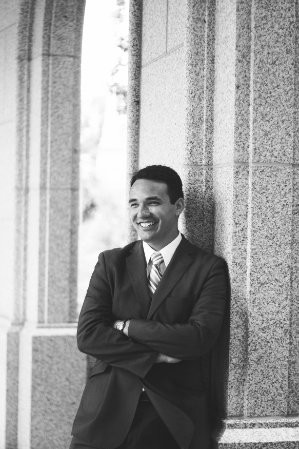

# Labs 9 - Cleaner POS

## Project Overview

This is a Lambda Labs Capstone Project designed for rental property management. It consolidates key tasks like invoicing and employee management into one central location.  

### Key Features

	* Manage multiple properties and multiple employees
	* Allow employees to track their progress
	* Allow employees to reassign tasks to other employees
	* Automatically generate guest invoices
	* Allow property managers to add new properties, assign properties to employees, and create and edit task checklists for employees
	* Allow guests to view readiness of their assigned rental property and pay their invoice online
	
See [Backend README]() for details, including technical specs, on the backend of our project.
See [Frontend README]() for details on the frontend.

### Contributors:

|   [Kelly Frohwein](https://github.com/kelfro)  |   [Chris Honda](https://github.com/honda0306)   |    [Ronald Libago](https://github.com/Mister-Corn)    |   [Nando Theessen](https://github.com/NandoTheessen)  |   [William VanDolah](https://github.com/wvandolah)  |
|:----------------:|:----------------:|:---------------:|:---------------:|:---------------:| 
|  |   |  |  |  
|